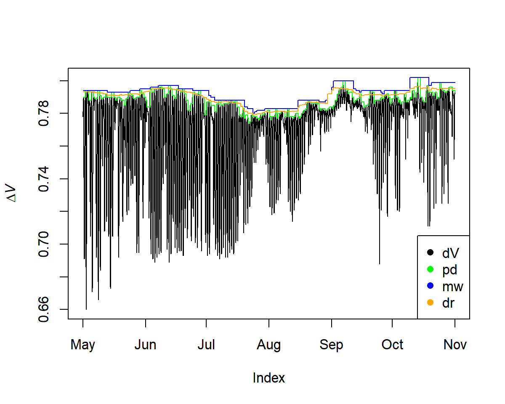
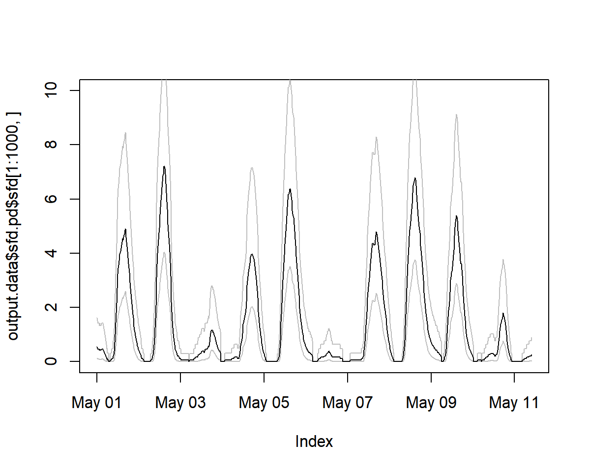
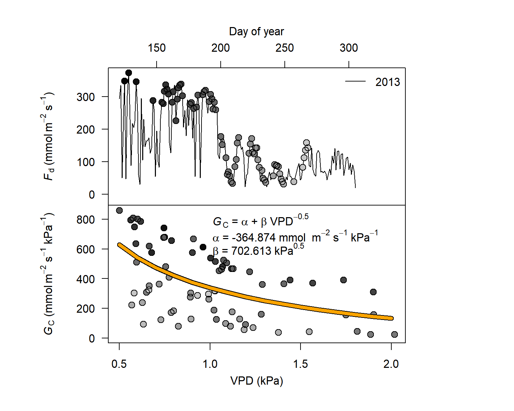

# TREX

<!-- badges: start -->
[](https://www.tidyverse.org/lifecycle/#maturing)
[](https://travis-ci.org/the-Hull/TREX)
<!-- badges: end -->


**Please note, that `TREX` is currently under developoment.  More information will be added in due time.**

---

`TREX` allows to assimilate, process and analyse on sap flow data obtained with the thermal dissipation method (TDM). 
The package includes functions for gap filling time-series data, detecting outliers, calculating data-processing uncertainties and generating uniform data output and visualisation.
The package is designed to deal with large quantities of data and apply commonly used data-processing methods. 
The functions have been validated on data collected from different tree species across the northern hemisphere [Peters et al. 2018 <doi: 10.1111/nph.15241>)](https://doi.org/10.1111/nph.15241).   


## Installation

A development version of `TREX` can be installed via

```r
remotes::install_github(remotes::install_github("the-Hull/TREX"))

```

## Basic use and workflow


### Load data

```r
# load raw data
raw   <- is.trex(example.data(type="doy"), tz="GMT",
                 time.format="%H:%M", solar.time=TRUE,
                 long.deg=7.7459, ref.add=FALSE)
                 
# adjust time steps
input <- dt.steps(input=raw, 
                start="2013-05-01 00:00",
                end="2013-11-01 00:00",
                time.int=15,
                max.gap=60,
                decimals=10,
                df=FALSE)
                
# remove obvious outliers
input[which(input<0.2)]<- NA


```

### Calculate maximum &Delta;T-Values

Here we apply three methods for calculating &Delta;T:  

- `pd`: pre-dawn
- `mw`: moving-window
- `dr`: double-regression

```r
input <- tdm_dt.max(input,
                    methods = c("pd", "mw", "dr"),
                    det.pd = TRUE,
                    interpolate = FALSE,
                    max.days = 10,
                    df = FALSE)
                    
plot(input$input, ylab = expression(Delta*italic("V")))

lines(input$max.pd, col = "green")
lines(input$max.mw, col = "blue")
lines(input$max.dr, col = "orange")

```


### Calculate Sap Flux Density


```r

output.data<- tdm_cal.sfd(input,make.plot=TRUE,df=FALSE,wood="Coniferous")

plot(output.data$sfd.pd$sfd[1:1000, ], ylim=c(0,10))
# add  uncertainty
lines(output.data$sfd.pd$q025[1:1000, ], lty=1,col="grey")
lines(output.data$sfd.pd$q975[1:1000, ], lty=1,col="grey")
lines(output.data$sfd.pd$sfd[1:1000, ])

sfd_data <- output.data$sfd.dr$sfd


```



### Generate Outputs including G<sub>c</sub>

```r
output<- out.data(input=sfd_data,
                  vpd.input=vpd, 
                  sr.input=sr,
                  prec.input=preci,
                  low.sr = 150,
                  peak.sr=300, 
                  vpd.cutoff= 0.5, 
                  prec.lim=1,
                  method="env.filt", 
                  max.quant=0.99, 
                  make.plot=TRUE)

```



